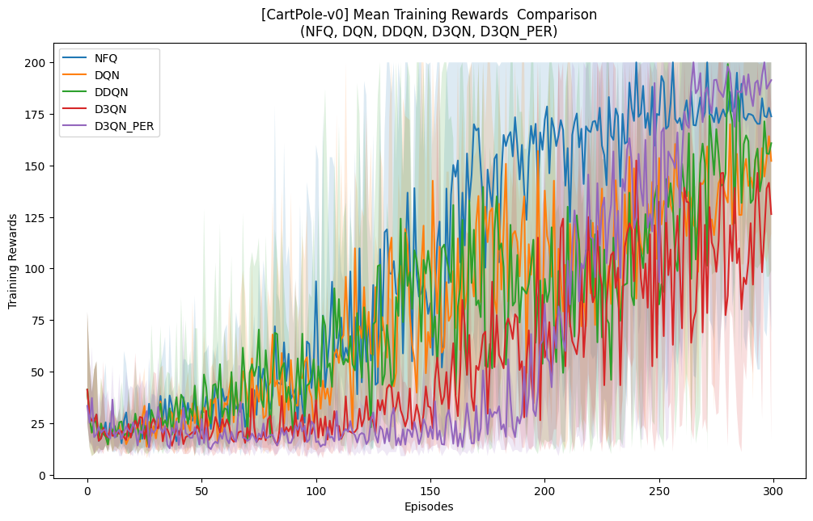
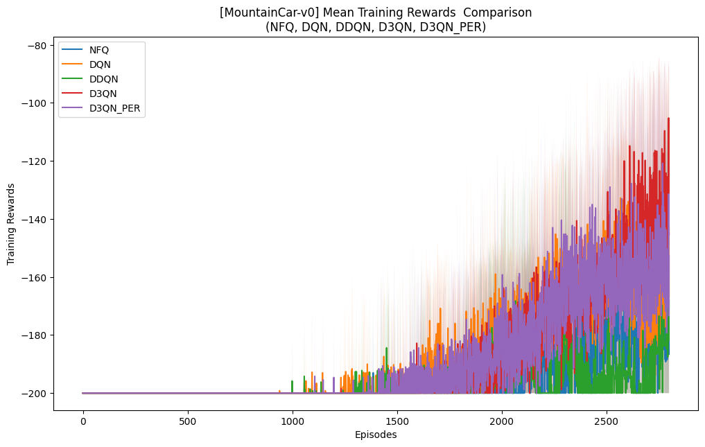

# Deep Q-Learning & Value-Based RL Benchmark

From-scratch PyTorch implementation of five deep value-based RL agents — **NFQ, DQN, Double DQN, Dueling Double DQN (D3QN), and Dueling Double DQN with Prioritized Experience Replay (D3QN-PER)** — benchmarked on two classic control environments with markedly different reward structures.

```
Author: Harsh Goel
Course Instructor: Prof. Ashutosh Modi
Course Code: CS780 
```

---

## Overview

This project implements the progression of deep value-based methods from the ground up: starting with Neural Fitted Q-Iteration and layering in each of the standard improvements — experience replay, a separate target network, double-DQN's action-selection/evaluation decoupling, dueling value/advantage streams, and prioritized experience replay — to isolate exactly what each addition contributes to learning speed, stability, and final performance.

**Environments:**
- **CartPole-v0** — dense reward (+1 per step survived), short horizon, simple dynamics.
- **MountainCar-v0** — sparse/delayed reward (−1 per step until goal), requiring the agent to discover a non-obvious "build momentum" strategy purely from negative feedback.

Every agent shares a common, from-scratch `ReplayBuffer` class (supporting both uniform and priority-based sampling) and is evaluated using identical training/evaluation protocols across **5 random seeds** per environment to control for variance.

---

## Agents Implemented

| Agent | Key Idea |
|---|---|
| **NFQ** (Neural Fitted Q) | Batch-fits a Q-network on all collected experience each iteration |
| **DQN** | Adds a replay buffer + separate target network to stabilize online TD updates |
| **Double DQN (DDQN)** | Decouples action *selection* (online net) from action *evaluation* (target net) to reduce over-estimation bias |
| **Dueling Double DQN (D3QN)** | Splits the Q-head into separate state-value and action-advantage streams |
| **D3QN-PER** | Adds prioritized experience replay, sampling high-TD-error transitions more frequently |

---

## Key Results

**Agent rankings flip between environments — there is no universal winner.** On CartPole-v0 (dense reward), **D3QN-PER** converges fastest and reaches the highest return, followed by NFQ, DDQN, DQN, with plain D3QN trailing. On MountainCar-v0 (sparse reward), the ranking inverts: **D3QN** performs best, followed closely by D3QN-PER, while NFQ and DDQN struggle the most against the sparse feedback signal.

<p align="center">
  
  
</p>
<p align="center"><sub>Mean training reward vs. episodes — CartPole-v0 (left) and MountainCar-v0 (right)</sub></p>

**Over-estimation bias is not uniformly harmful.** Double DQN outperforms DQN on CartPole but underperforms it on MountainCar — suggesting that in sparse-reward settings, DQN's optimistic Q-estimates can actually *encourage* the exploration needed to discover the momentum-building strategy, even though the estimates themselves are less accurate.

**Prioritized replay's benefit is environment-dependent.** PER-based sampling gives the clearest advantage on CartPole, where prioritizing high-error transitions accelerates fitting. On MountainCar, however, its bias toward high-TD-error samples can *narrow* exploration of the state space, letting plain D3QN's uniform sampling edge it out.

**NFQ remains a surprisingly strong baseline** in the simpler, dense-reward CartPole setting — despite not explicitly addressing the non-IID/moving-target issues that motivate DQN — but degrades sharply on the sparse-reward MountainCar task, where it struggles to fit a useful Q-function from mostly uninformative feedback.

---

## Tech Stack

`Python` · `PyTorch` · `Gymnasium` (CartPole-v0, MountainCar-v0) · `NumPy` · `Matplotlib`

All agents, the replay buffer (uniform and prioritized), and training loops are implemented from scratch on top of PyTorch — no high-level RL library is used.

---

## Repository Structure

```
.
├── deep-value-rl-agents.ipynb   # Full implementation, experiments & analysis
├── assets/                       # Result plots referenced in this README
└── README.md
```

## Running

Open `deep-value-rl-agents.ipynb` and run top-to-bottom. Each agent class builds on a shared `ReplayBuffer` interface; the final sections run all five agents across both environments and generate the comparison plots shown above.
